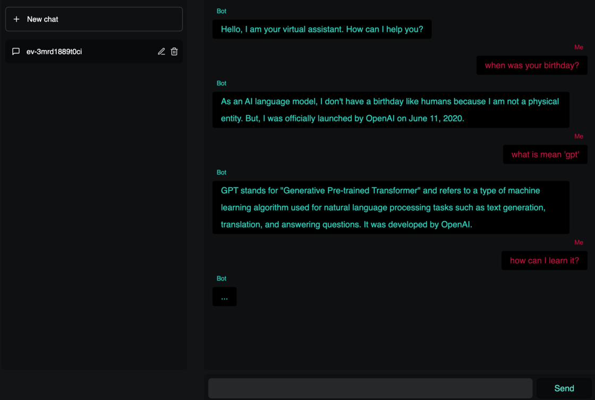
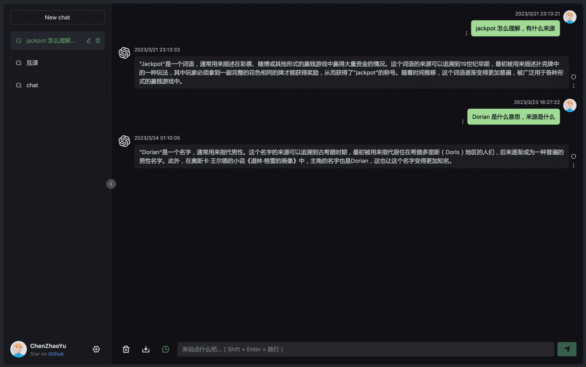

# Morrigan

OpenAI/ChatGPT Backend with conversation and API

## Features
 - Support text/event-steam
 - Chat History for Conversation (based on redis)
 - RESTful API
 - Welcome message and preset messages
 - Login with OAuth2 client for general Security Provider

## Supported Frontend

<details>
 <summary>chatgpt-svelte based on Svelte  ⤸</summary>

 

> forked: https://github.com/liut/chatgpt-svelte

</details>

<details>
 <summary>chatgpt-web based on Vue.js  ⤸</summary>

 

> forked: https://github.com/liut/chatgpt-web

</details>


## APIs

### Get welcome message and new conversation ID

<details>
 <summary><code>GET</code> <code><b>/api/welcome</b></code></summary>

##### Parameters

> None

##### Responses

> | http code     | content-type                      | response                                           |
> |---------------|-----------------------------------|---------------------------------------------------------------------|
> | `200`         | `application/json`        | `{"message": "welcome message", "id": "new-cid"}`                                         |


</details>

### Get user information of that has been verified or signed in

<details>
 <summary><code>GET</code> <code><b>/api/me</b></code></summary>

##### Parameters

> None

##### Responses

> | http code     | content-type                      | response                                           |
> |---------------|-----------------------------------|---------------------------------------------------------------------|
> | `200`         | `application/json`        | `{"data": {"avatar": "", "name": "name", "uid": "uid"}}`                                         |
> | `401`         | `application/json`        | `{"error": "", "message": ""}`                                         |


</details>

### Post chat prompt and return Streaming messages

<details>
 <summary><code>POST</code> <code><b>/api/chat-sse</b></code> or <code><b>/api/chat</b></code> with <code>{steam: true}</code></summary>

##### Parameters

> | name       |  type     | data type      | description                         |
> |------------|-----------|----------------|-------------------------------------|
> | `csid`     |  optional | string       | conversation ID        |
> | `prompt`   |  required | string       | message for ask        |
> | `stream`   |  optional |  bool        | enable event-steam, force on <code><b>/api/chat-sse</b></code>       |


##### Responses

> | http code     | content-type               | response                                           |
> |---------------|----------------------------|----------------------------------------------------|
> | `200`         | `text/event-stream`        | `{"delta": "message fragments", "id": "conversation ID"}`                                          |
> | `401`         | `application/json`        | `{"status": "Unauthorized", "message": ""}`                                         |


</details>

<details>
 <summary><code>POST</code> <code><b>/api/chat-process</b></code> for chatgpt-web only</summary>

##### Parameters

> | name        |  type     | data type      | description                         |
> |-------------|-----------|----------------|-------------------------------------|
> | `prompt`    | required  |    string      | message for ask        |
> | `options`   | optional  |    object      | <code>{ conversationId: "" }</code>    |


##### Responses

> | http code     | content-type                    | response                                           |
> |---------------|---------------------------------|-----------------------------------------------------|
> | `200`         | `application/octet-stream`      | `{"delta": "message fragments", "text": "message", "conversationId": ""}`                                          |
> | `401`         | `application/json`        | `{"status": "Unauthorized", "message": ""}`                                         |


</details>

## Getting started

```bash

test -e .env || cp .env.example .env
# Edit .env and change api key of OpenAI
# Embedding and replacing frontend resources

make deps

forego start

# or

make dist


```

### Prepare preset data file in YAML

```yaml

welcome:
  content: Hello, I am your virtual assistant. How can I help you?
  role: assistant

messages:
  - content: You are a helpful assistant.
    role: system
  - content: When is my birthday?
    role: user
  - content: How would I know?
    role: assistant

 # more messages

```

### Change settings with environment

#### Show all local settings
```bash
go run . -usage
```

Example:

```plan
MORRIGAN_OPENAI_API_KEY=oo-xx
MORRIGAN_HTTP_LISTEN=:3002

# optional preset data
MORRIGAN_PRESET_FILE=./data/preset.yaml

# optional OAuth2 login
MORRIGAN_AUTH_REQUIRED=true
OAUTH_PREFIX=https://portal.my-company.xyz

# optional proxy
HTTPS_PROXY=socks5://proxy.my-company.xyz:1081
```

### Command line usage

```plan

USAGE:
   morrigan [global options] command [command options] [arguments...]

COMMANDS:
   usage, env                   show usage
   initdb                       init database schema
   import                       import documents from a csv
   fill-qa, fillQAs             fill QA in documents
   export-qa, exportQAs         export QA from documents
   embedding, embedding-pormpt  read prompt documents and embedding
   web, run                     run a web server
   help, h                      Shows a list of commands or help for one command

GLOBAL OPTIONS:
   --help, -h  show help

```


### Embedding frontend resources

1. Go to frontend project directory
2. Build frontend pages and accompanying static resources.
3. Copy them into ./htdocs

Example:

```bash
cd ../chatgpt-svelte
npm run build
rsync -a --delete dist/* ../morrigan/htdocs/
cd -
```

During the development and debugging phase, you can still use with proxy to collaborate with the front-end project.

