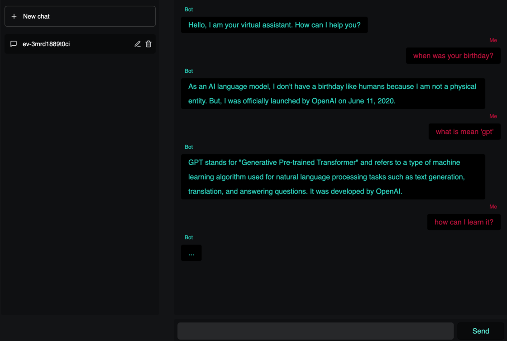
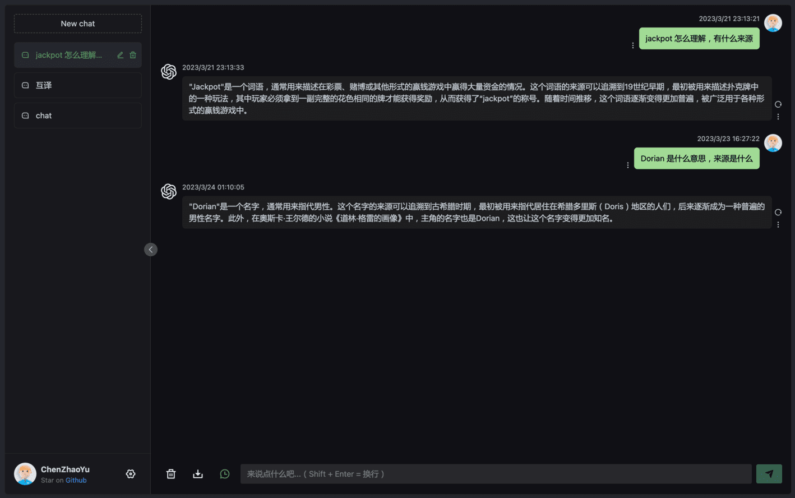

# Morrigan

Backend implementation of a knowledge base system for AI chat.

## Features
 - Import documents of knowledge base from a table (CSV), save them into PostgreSQL
 - Based on the title and content of the document, generate vector of documents with Embedding API
 - Generate document vectors using Embedding API
 - Implement high-quality Q&A using vector search
 - Welcome message and preset messages
 - Chat History for Conversation (based on redis)
 - RESTful API
 - Support text/event-stream
 - Login with OAuth2 client for general Security Provider
 - Built-in MCP (Model Context Protocol) tool support

## Supported Frontend

<details>
 <summary>chatgpt-svelte based on Svelte  ⤸</summary>

 

> forked: https://github.com/liut/chatgpt-svelte

</details>

<details>
 <summary>calisyn based on Vue.js  ⤸</summary>

 

> forked: https://github.com/liut/calisyn

</details>


## APIs

### Get welcome message and new conversation ID

<details>
 <summary><code>GET</code> <code><b>/api/welcome</b></code></summary>

##### Parameters

> None

##### Responses

> | http code     | content-type                      | response                                           |
> |---------------|-----------------------------------|---------------------------------------------------------------------|
> | `200`         | `application/json`        | `{"message": "welcome message", "id": "new-cid"}`                                         |


</details>

### Get user information of that has been verified or signed in

<details>
 <summary><code>GET</code> <code><b>/api/me</b></code></summary>

##### Parameters

> None

##### Responses

> | http code     | content-type                      | response                                           |
> |---------------|-----------------------------------|---------------------------------------------------------------------|
> | `200`         | `application/json`        | `{"data": {"avatar": "", "name": "name", "uid": "uid"}}`                                         |
> | `401`         | `application/json`        | `{"error": "", "message": ""}`                                         |


</details>

### Post chat prompt and return Streaming messages

<details>
 <summary><code>POST</code> <code><b>/api/chat-sse</b></code> or <code><b>/api/chat</b></code> with <code>{stream: true}</code></summary>

##### Parameters

> | name       |  type     | data type      | description                         |
> |------------|-----------|----------------|-------------------------------------|
> | `csid`     |  optional | string       | conversation ID        |
> | `prompt`   |  required | string       | message for ask        |
> | `stream`   |  optional |  bool        | enable event-stream, force on <code><b>/api/chat-sse</b></code>       |


##### Responses

> | http code     | content-type               | response                                           |
> |---------------|----------------------------|----------------------------------------------------|
> | `200`         | `text/event-stream`        | `{"delta": "message fragments", "id": "conversation ID"}`                                          |
> | `401`         | `application/json`        | `{"status": "Unauthorized", "message": ""}`                                         |


</details>

<details>
 <summary><code>POST</code> <code><b>/api/chat-process</b></code> for chatgpt-web only</summary>

##### Parameters

> | name        |  type     | data type      | description                         |
> |-------------|-----------|----------------|-------------------------------------|
> | `prompt`    | required  |    string      | message for ask        |
> | `options`   | optional  |    object      | <code>{ conversationId: "" }</code>    |


##### Responses

> | http code     | content-type                    | response                                           |
> |---------------|---------------------------------|-----------------------------------------------------|
> | `200`         | `application/octet-stream`      | `{"delta": "message fragments", "text": "message", "conversationId": ""}`                                          |
> | `401`         | `application/json`        | `{"status": "Unauthorized", "message": ""}`                                         |


</details>

## Getting started

```bash

# Install dependencies (includes forego for env loading)
make deps

# Or manually
go mod tidy
go install github.com/ddollar/forego@latest

# Create .env from example and configure (update PG/Redis URLs, API keys, etc.)
test -e .env || cp .env.example .env

# Start server with environment variables from .env
forego start

# Or directly (for development)
forego run go run . web

```

### Prepare preset data file in YAML

```yaml

welcome:
  content: Hello, I am your virtual assistant. How can I help you?
  role: assistant

messages:
  - content: You are a helpful assistant.
    role: system
  - content: When is my birthday?
    role: user
  - content: How would I know?
    role: assistant

 # more messages

```

### Prepare database

```sql
CREATE USER morrigan WITH LOGIN PASSWORD 'mydbusersecret';
CREATE DATABASE morrigan WITH OWNER = morrigan ENCODING = 'UTF8';
GRANT ALL PRIVILEGES ON DATABASE morrigan to morrigan;


\c morrigan

-- optional: install extension from https://github.com/pgvector/pgvector
CREATE EXTENSION vector;

```

### Command line usage

```plan

USAGE:
   morign [global options] command [command options] [arguments...]

COMMANDS:
   usage, env                   show usage
   initdb                       init database schema
   import                       import documents from a csv
   export                       export documents to csv/jsonl
   embedding, embedding-prompt  read prompt documents and embedding
   agent, llm, chat            test LLM agent
   web, run                     run a web server
   version, ver                 show version
   help, h                      Shows a list of commands or help for one command

GLOBAL OPTIONS:
   --help, -h  show help

```

#### Agent Command

Test LLM functionality from command line:

```bash
# Non-streaming chat
./morign agent -m "hello"

# Streaming chat
./morign agent -m "hello" -s

# Show verbose logs
./morign agent -m "hello" -v
```

Parameters:
- `-m, --message`: message to send (required)
- `-s, --stream`: enable streaming response
- `-v, --verbose`: show logs (disabled by default)


### Change settings with environment

#### Show all local settings
```bash
./morign usage
```

Example:

```plan
# Interact provider (chat)
MORIGN_INTERACT_API_KEY=sk-xxx
MORIGN_INTERACT_MODEL=gpt-4o-mini
MORIGN_INTERACT_URL=https://api.openai.com/v1

# Embedding provider (vector)
MORIGN_EMBEDDING_API_KEY=sk-xxx
MORIGN_EMBEDDING_MODEL=text-embedding-3-small

# Summarize provider (optional)
MORIGN_SUMMARIZE_API_KEY=sk-xxx
MORIGN_SUMMARIZE_MODEL=gpt-4o-mini

MORIGN_HTTP_LISTEN=:3002

# optional preset data
MORIGN_PRESET_FILE=./data/preset.yaml

# optional OAuth2 login
MORIGN_AUTH_REQUIRED=true
OAUTH_PREFIX=https://portal.my-company.xyz

# optional proxy
HTTPS_PROXY=socks5://proxy.my-company.xyz:1081
```

#### Environment Variables

| Variable | Default | Description |
|----------|---------|-------------|
| `MORIGN_PG_STORE_DSN` | postgres://morrigan@localhost/morrigan | PostgreSQL connection string |
| `MORIGN_REDIS_URI` | redis://localhost:6379/1 | Redis connection string |
| `MORIGN_HTTP_LISTEN` | :5001 | HTTP listen address |
| `MORIGN_AUTH_REQUIRED` | false | Enable authentication |
| `MORIGN_KEEPER_ROLE` | keeper | Role required for write operations |
| `MORIGN_VECTOR_THRESHOLD` | 0.39 | Vector similarity threshold |
| `MORIGN_VECTOR_LIMIT` | 5 | Number of vector matches |

#### Provider Configuration (AI Services)

Each provider requires `API_KEY` and `MODEL`, optional `URL` and `TYPE` for custom endpoints:

| Provider | Purpose | Required Variables |
|----------|---------|-------------------|
| `INTERACT` | Chat/completion | `API_KEY`, `MODEL` |
| `EMBEDDING` | Vector embedding | `API_KEY`, `MODEL` |
| `SUMMARIZE` | Text summarization | `API_KEY`, `MODEL` |

Supported Provider Type: `openai`, `anthropic`, `openrouter`, `ollama`

Example:
```
# Interact provider (supports openai/anthropic/openrouter/ollama)
MORIGN_INTERACT_API_KEY=sk-xxx
MORIGN_INTERACT_MODEL=gpt-4o-mini
MORIGN_INTERACT_TYPE=openai  # optional, default openai

# Using Anthropic
MORIGN_INTERACT_TYPE=anthropic
MORIGN_INTERACT_MODEL=claude-3-5-sonnet

# Embedding provider
MORIGN_EMBEDDING_API_KEY=sk-xxx
MORIGN_EMBEDDING_MODEL=text-embedding-3-small

# Summarize provider
MORIGN_SUMMARIZE_API_KEY=sk-xxx
MORIGN_SUMMARIZE_MODEL=gpt-4o-mini
```

> Tip: Run `./morign usage` to view all current configurations

## The operation steps for generating data.

1. Prepare a CSV file for the corpus document.
2. Import documents.
3. Generate Questions and Answers from documents with Completion.
4. Generate Prompts and vector from QAs with Embedding
5. Done and go to chat

### CSV template of documents

| title      | heading     | content                                   |
|------------|-------------|-------------------------------------------|
| my company | introduction | A great company stems from a genius idea. |
|            |             |                                           |

```bash
./morign initdb
./morign import mycompany.csv
./morign embedding
```


## Attach frontend resources

1. Go to frontend project directory
2. Build frontend pages and accompanying static resources.
3. Copy them into ./htdocs

Example:

```bash
cd ../chatgpt-svelte
npm run build
rsync -a --delete dist/* ../morign/htdocs/
cd -
```

During the development and debugging phase, you can still use with proxy to collaborate with the front-end project.

