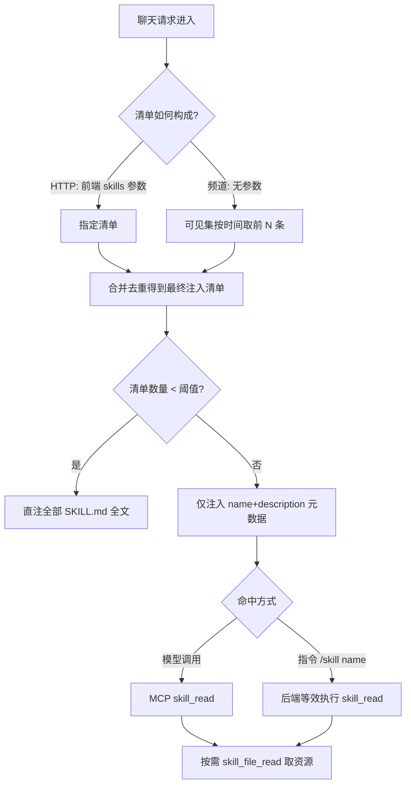

> **2026-08-05 修订（Channel）：** Channel 语义改为「默认私有 + 显式频道投放」（原默认 all/全频道公开废止），取消「全平台公开」档（0=未投放），name 全局唯一不变，无存量数据不需迁移。本计划 status 由 completed 转 active，待办仅限下列修订点；其余 U1-U7 已实现（见 git）。
>
> **2026-08-05 修订（存储形态）：** 资源文件从技能行内 JSONB map 拆分为独立表 `agent_skill_file`（方案 B）：SKILL.md 留在 `agent_skill`，资源文件按「一行一文件」落库；内容统一 `bytea` 存储 + `mime`/`kind`（text/binary）元数据，文本按 UTF-8 字节存，二进制可存但不内联进 LLM 上下文。无存量数据，直接调整无需迁移；已实现的 U1/U2/U6/U7 需按新形态回改。

# feat: Skill 支持

## Summary

以开放 Agent Skills 标准为格式，新增 DB 存储的 Skill bundle 与完整加载链路：前端圈定清单后 system prompt 只注入元数据，全文经 skill_read 按需加载（模型 MCP 调用 / 指令等效执行），清单小于阈值时直注全文；skill_read 返回 SKILL.md，skill_file_list 返回资源清单，资源内容经 skill_file_read 按需获取。CRUD 由 codegen 生成，用户自建接口手写，管理端与导入后置。2026-08-05 修订：Channel 默认私有 + 显式频道投放，取消全平台公开档；资源文件分表存储（`agent_skill_file`），SKILL.md 留在技能行。

---

## Problem Frame

Morrigan 是 HTTP 后端，HTTP 聊天与 WeCom/飞书频道共用同一 system prompt 构建路径，但当前没有任何"程序化指令注入"能力，也没有可被模型与前端共同发现的技能单元。Skill 生态已收敛为开放 Agent Skills 标准（SKILL.md bundle + 渐进披露），旧方案（2026-04 skill-mcp-tools）未落地且形态已过时。完整背景见 origin 文档。

---

## Requirements

本计划满足 origin 文档的全部需求（R1-R11），并补充实现级需求 R12-R13，trace 如下：

- R1. Skill 以 bundle 形态存 DB，格式遵循开放 Agent Skills 标准（SKILL.md + scripts/references/assets）
- R2. 实体共享字段：Channel 位掩码（默认私有/未投放）、owner、时间戳；name 全局唯一
- R3. 上下文可见规则：Channel 显式投放的频道 ∪ 当前用户创建；未投放仅创建者可见
- R4. REST 可见元数据列表与详情
- R5. 用户可创建/编辑/删除自己的 skill；CRUD 由 codegen 生成，自建能力手写
- R6. system prompt 默认只注入元数据（name+description）
- R7. 清单数量小于阈值（默认 3，可配置）时直注全部 SKILL.md 全文
- R8. 全文加载统一经 skill_read：模型 MCP 调用 / 指令等效执行；API skills 参数只圈定范围
- R9. skill_read 返回 SKILL.md；skill_file_list 返回资源清单；skill_file_read 按需取内容
- R10. 频道默认清单 = 可见集按时间前 N 条（N 可配置）；/skill 指令激活任意可见 skill
- R11. 导入（URL / .skill / .zip）与全局管理接口后置，仅预留
- R12. 不提供「全平台公开」档：公开只经显式投放（可多选 web/wecom/feishu），0 语义为未投放
- R13. 资源文件分表存储：`agent_skill_file` 一行一文件（SKILL.md 仍在 `agent_skill.content`）；内容统一 `bytea`，`kind` 区分 text/binary，二进制不内联进 LLM 上下文

**Origin actors:** A1 Web/API 用户、A2 频道用户、A3 LLM、A4 Keeper/管理员（后置）
**Origin flows:** F1 Web 圈定清单并发起对话、F2 频道默认加载与指令激活、F3 LLM 分析命中加载全文
**Origin acceptance examples:** AE1（小清单直注全文）、AE2（≥阈值仅元数据 + skill_read）、AE3（/skill 指令剥离文本并注入）、AE4（own 可见、他人不可见）、AE5（skill_file_read 按需、未调用不进上下文）

---

## Scope Boundaries

- 管理端 CRUD（全局管理、分享管理、审核）不进本计划
- 导入导出（URL / .skill / .zip）不进本计划（origin R11 仅预留）
- 脚本执行不进 v1：脚本仅作为内容存取，执行仍归外部 Shell MCP
- MCP skill_list 与 REST 列表同源（同一可见性查询）：skill_list 默认取少量条目供模型发现（频道侧无 REST 通道，是模型唯一的清单外发现入口）；REST 提供前端分页列表（web 圈定用）
- 后端不持久化前端 last choices（前端职责）
- 私有命名空间、版本化、skill 市场后置
- 无「全平台公开」档：公开 = 显式勾选全部频道（2026-08-05 修订）；用户级/团队级分享继续后置

### Deferred to Follow-Up Work

- 管理端 CRUD 与导入导出（URL / .skill / .zip）：后续独立计划（对应 origin R11 后置项）
- skill 指令别名与帮助文案：随管理端一起补充

---

## Context & Research

### Relevant Code and Patterns

- codegen 管线：docs/mcps.yaml → pkg/models/mcps/mcps_gen.go、pkg/services/stores/mcps_gen.go、pkg/web/api/handle_mcps_gen.go；命令为 `make codegen MDs=docs/skills.yaml`；_gen.go 不手改，扩展走 _x.go
- 工具注册：pkg/services/tools/registry.go（RegisterInvoker、initTools、privTools、频道工具集）、tools/defines.go（ToolDescriptor）、tools/invokers.go（参数解析与 BuildToolErrorResult 约定）
- 指令机制：pkg/web/api/commands.go（commandRegistry、DetectCommand、Action 返回 handled 即停）；handle_platform.go:157 附近的消息处理分支
- system prompt 构建：pkg/web/api/handle_convo.go prepareSystemMessage（HTTP 与频道共用，经 buildChatMessagesAndTools）；agent/prompt.go DefaultSystemMsg/DefaultToolsMsg
- 请求参数：pkg/web/api/convo_basic.go ChatRequest（MCPs 字段已声明但全仓库无消费点——skills 为净新增）
- 频道上下文：pkg/models/mcps/mcps_x.go ContextWithChannel/ChannelFromContext
- 配置：pkg/settings/config.go envconfig 模式（KeeperRole、VectorThreshold 等）
- Storage 接口：pkg/services/stores/interfaces.go 为手写，可扩展访问器；store 手写扩展参照 mcps_x.go
- 权限：stores/auth.go IsKeeper + UserFromContext

### Institutional Learnings

- docs/solutions/runtime-errors/streaming-reply-multiple-startstream.md：流式回复循环中不得重复触发 StartStream。对本计划的约束：注入逻辑全部发生在消息构建期（prepareSystemMessage 与指令解析期），严禁进入流式循环
- 频道级作用域先例：docs/plans/2026-06-02-001-feat-channel-mcp-tools-plan.md 证明"按频道上下文过滤工具"的可行性，skill 可见性过滤沿用同一上下文通道

### External References

- Agent Skills 开放标准（agentskills/agentskills specification）：SKILL.md YAML frontmatter（name/description 必填）、渐进披露三级加载、scripts/references/assets 目录约定、SKILL.md 建议 <500 行

---

## Key Technical Decisions

- **单注入点**：prepareSystemMessage 同时服务 HTTP 与频道两条路径（已核实 buildChatMessagesAndTools 调用同一函数），skill 注入只挂这一处，避免双路径分叉
- **skills 参数净新增**：ChatRequest.MCPs 声明但未消费，skills 参数消费逻辑无现成模式可复用，按"仅圈定清单范围"语义新写
- **指令语义扩展**：现有 Command.Action 语义为"处理完即停"；skill 指令需要"注入全文后继续对话"，扩展 Command 结构（增加继续模式）而非为 skill 指令开特例分支
- **共享加载器**：skill_read 工具、/skill 指令、详情 API 全部经同一可见性校验加载器（store 层 LoadForName）；分表后 LoadForName 只返回技能行（含 SKILL.md，不含资源文件），文件访问器（ListFileNames / ReadFile）仍先过同一可见性校验
- **文件分表存储**：资源文件独立表 agent_skill_file（skill_id + path 复合唯一、content bytea、mime、kind、size）；bundle 为原子单元，创建/更新在事务内按 (skill_id, path) upsert（ON CONFLICT DO UPDATE），被移除的路径 DELETE 清理，不做文件级 diff
- **文本/二进制存储**：content 统一 bytea，文本按 UTF-8 字节落库；kind 在写入时按 mime → 扩展名 → UTF-8/NUL 嗅探判定；skill_file_read 对 text 内联内容，对 binary 返回 path/mime/size 元数据并说明不可内联
- **文件大小上限**：单文件默认 1MB、单技能总量默认 10MB（可配置），写入时校验
- **阈值判定口径**：按"最终注入清单"（前端指定 + 默认补全合并后）的数量判定，而非可见技能总量
- **Channel 位掩码**：复用 codegen 的 multiple 枚举先例（参照 mcps.yaml HeaderCate）；默认私有（未投放），0 语义为「未投放」而非「不限」，取消 all/全平台公开档，公开 = 显式勾选全部频道（2026-08-05 修订）
- **可见性由 VisibleOnly 显式控制**：投放频道 + owner 规则在 store 层实施；ListVisibleMetadata 强制 VisibleOnly=true（防客户端绕过），管理端 ListSkill 不设标志、全量可见；工具/API/指令复用同一查询
- **生成 CRUD 与自建接口分工**：codegen 生成的 CRUD（needPerm）面向 keeper；用户自建接口手写一层 owner 语义，两者并存
- **skill_* 工具族全局注册、调用时校验**：与频道工具模式一致，避免按上下文动态组装工具集

---

## Open Questions

### Resolved During Planning

- 阈值判定口径：最终注入清单数量（用户已确认）
- 指令机制扩展方向："处理并继续"语义（用户已确认方向）
- skills 参数消费：净新增（MCPs 参数未接线，已核实）
- Channel 语义与默认值（2026-08-05 修订：默认私有、取消 all/全平台公开档、0=未投放；用户已确认）

### Deferred to Implementation

- docs/skills.yaml 字段细节：agent_skill_file 模型字段命名（skills 包内模型直接命名 File，与 Skill 同文件定义、同文件生成，无独立 _gen 文件；存储结构已定：分表 + bytea/mime/kind，剩余为字段级细节）
- 文件大小上限的配置项命名与默认值（方向：单文件 1MB、单技能总量 10MB）
- skill_* 工具返回结构的精确 JSON 形状与内容截断上限
- 阈值与 N 配置项的最终命名
- /skill 指令的别名与匹配细节
- 用户自建接口的 frontmatter 校验规则细节（YAML 解析库选择）

---

## Output Structure

计划新增/生成的主要文件（生成产物由 codegen 产出，路径为预期形状）：

    docs/skills.yaml                        # 模型定义（新建）
    pkg/models/skills/skills_gen.go         # 生成：Skill 与 File 模型（同一 yaml 产出）
    pkg/models/skills/skills_x.go           # 手写：frontmatter 校验、位掩码辅助
    pkg/services/stores/skills_gen.go       # 生成：skillStore LGCUD
    pkg/services/stores/skills_x.go         # 手写：可见性、加载器、默认清单、文件访问器与事务写入
    pkg/web/api/handle_skills_gen.go        # 生成：keeper CRUD 路由
    pkg/web/api/handle_skills_x.go          # 手写：路由挂载与手写接口
    pkg/services/agent/skill_inject.go      # 手写：注入核心（新建）
    pkg/services/tools/skills.go            # 手写：skill_* 工具（新建）
    pkg/services/tools/skills_test.go       # 测试

---

## High-Level Technical Design

> *This illustrates the intended approach and is directional guidance for review, not implementation specification. The implementing agent should treat it as context, not code to reproduce.*

加载决策流程：

组件接线：store 层提供唯一可见性加载器（LoadForName）；注入核心、skill_* 工具、/skill 指令、详情 API 全部消费同一加载器；注入核心只产出文本块，由 prepareSystemMessage 拼入 system prompt。

---

## Implementation Units

### U1. docs/skills.yaml 与 codegen 骨架

**Goal:** 新增 Skill 与 File 数据模型定义，跑通 codegen 生成模型/store/keeper CRUD 骨架，建立手写扩展文件。

**Requirements:** R1, R2, R5, R13

**Dependencies:** None

**Files:**
- Create: `docs/skills.yaml`（含 Skill 与 File 两个模型）
- Generated: `pkg/models/skills/skills_gen.go`、`pkg/services/stores/skills_gen.go`、`pkg/web/api/handle_skills_gen.go`（由 `make codegen MDs=docs/skills.yaml` 产出，Skill 与 File 同文件生成）
- Create: `pkg/models/skills/skills_x.go`、`pkg/services/stores/skills_x.go`、`pkg/web/api/handle_skills_x.go`
- Test: `pkg/models/skills/skills_test.go`、`pkg/services/stores/skill_store_test.go`

**Approach:**
- 以 docs/mcps.yaml 为模板：enums 定义 Channel 位掩码（multiple:true，值 web/wecom/feishu；默认私有，0=未投放，取消 all 语义）；models 定义 Skill：Name（全局唯一 + match 查询）、Description、Content（SKILL.md 正文，不含资源文件）、Channel（位掩码枚举，默认未投放）、Owner（字符串 uid）、时间戳（comm.DefaultModel）
- 新增 File 模型（agent_skill_file）：SkillID 与 Path 仅 basic（复合键，不可变更）、Content（bytea）、Mime、Kind（text/binary）、Size（字节）、时间戳；Content/Mime/Kind/Size 均 isset（可更新），Files JSONB 字段从 Skill 移除
- stores 声明 skillStore（LGCUD），webapi 配 needAuth + needPerm、uris 前缀 /api/skill
- 运行 codegen 生成骨架并提交产物；_gen.go 不手改，后续扩展全部落在 _x.go
- 手写骨架先行落位：model 层 frontmatter 校验与位掩码辅助函数占位；store 层 afterLoad/afterList 钩子占位
- 位掩码枚举值需按位对齐（1、2、4…）；0 表示未投放（仅 owner 可见），不再按通配处理（2026-08-05 修订，docs/skills.yaml 注释已同步为 0=无）

**Patterns to follow:**
- docs/mcps.yaml → mcps_gen.go / handle_mcps_gen.go 的生成对应关系
- stores 生成 init 中 RegisterModel 注册模式

**Test scenarios:**
- Happy path: codegen 后模型字段与 JSON tag 与 spec 一致；skillStore CRUD 冒烟（create/get/update/delete）
- Edge case: Channel 位掩码解码（单值 + 组合值）；默认值 = 未投放（0）；Name 唯一约束冲突返回明确错误
- Error path: 非法枚举值拒绝写入
- Integration: 创建带 owner 的记录后可按 id/name 读取（Covers AE4 的数据基础）

**Verification:**
- 模型与 store 相关测试目标通过；codegen 产物包含 Skill 与 File 模型、skillStore、/api/skill 路由注册

---

### U2. store 层：可见性、加载器与默认清单

**Goal:** 在 skillStore 手写扩展中实现上下文可见规则、按名加载器（skill_read 工具与指令共用）、可见元数据列表与 top-N recent 查询，以及资源文件访问器与事务写入。

**Requirements:** R3, R4, R8, R10, R13

**Dependencies:** U1

**Files:**
- Modify: `pkg/services/stores/skills_x.go`、`pkg/services/stores/interfaces.go`
- Test: `pkg/services/stores/skill_store_test.go`（集成）

**Approach:**
- 可见规则：可用 = Channel 显式投放到 ctx 频道（mcps.ChannelFromContext）或 Owner == ctx 用户（UserFromContext）；未投放（0）仅 Owner 可见
- 查询接口：ListVisibleMetadata（仅 name+description）、GetVisible（含全文，校验可见）、TopRecent(n)（按创建时间倒序）
- LoadForName(ctx, name)：统一可见性校验的加载器——skill_read 工具、指令注入、详情 API 全部经它；name 全局唯一，先按名加载（dbGetWith）、再在 Go 层校验可见性；越权返回 not found（不泄露存在性）；分表后仅返回技能行（content=SKILL.md），不再加载资源文件
- 文件访问器：ListFileNames(ctx, name) 先经 LoadForName 过可见性，再只查 path+size+mime（不含 content）；ReadFile(ctx, name, path) 过可见性后按 (skill_id, path) 取单文件，binary 只返回元数据
- 文件事务写入：CreateSkill/UpdateSkill 带资源文件时在事务内按 (skill_id, path) upsert（ON CONFLICT DO UPDATE，复合唯一键由手写 SQL 处理，生成的 dbInsert 仅支持单列冲突），被移除的路径 DELETE 清理；DeleteSkill 级联删除文件行；写入时按 mime → 扩展名 → UTF-8/NUL 嗅探判定 kind，并校验单文件/单技能大小上限
- name 唯一冲突：依赖 DB unique 约束 + 错误映射，供 U7 使用

**Patterns to follow:**
- pkg/services/stores/mcps_x.go 的 afterLoad 钩子风格
- pkg/models/mcps/mcps_x.go 的 ChannelFromContext 用法

**Test scenarios:**
- Happy path: 用户 A 可见自己的 skill + Channel 含当前频道的 skill；元数据列表不含 content
- Edge case: 默认未投放（0）仅 owner 可见；显式投放后该频道所有用户可见；TopRecent 返回按时间倒序的前 N 条；binary 文件落库后 kind=binary、读取不内联内容；文件清单不含 content
- Error path: 越权 LoadForName 返回 not found（Covers AE4）；name 冲突创建返回明确错误
- Integration: 用户 B 在 wecom 看不到 A 未投放的 skill，而 A 自己在 wecom 可见自己的 skill（Covers AE4）

**Verification:**
- stores 集成测试通过；越权读取在 store 层被拒，工具/API/指令路径无需重复实现；文件访问器与事务整包写入有集成覆盖

---

### U3. 注入核心

**Goal:** 实现注入决策与组装逻辑：给定上下文与清单（前端指定 + 默认补全），按阈值决定元数据或直注全文；提供指令注入入口（等效 skill_read）。

**Requirements:** R6, R7, R8, R10

**Dependencies:** U2

**Files:**
- Create: `pkg/services/agent/skill_inject.go`
- Modify: `pkg/settings/config.go`（阈值与 N 配置项）
- Test: `pkg/services/agent/skill_inject_test.go`

**Approach:**
- resolveList(ctx, requested)：HTTP 用前端指定清单，频道用 TopRecent(N) 默认清单，合并去重
- 阈值判定（默认 3，可配置）：清单数量 < 阈值 → 逐条 LoadForName 组装全文；否则组装元数据块（name+description）
- InjectByCommand(ctx, name)：LoadForName 后返回全文注入块，供 U5 使用——与 skill_read 工具同源
- 输出为纯文本块（不直接写 system prompt），便于单测；注入块生成失败时降级（不阻塞对话）
- 配置项：阈值默认 3、N 默认值（如 5），envconfig 模式

**Patterns to follow:**
- pkg/services/agent/prompt.go 的文本组装风格
- pkg/settings/config.go envconfig 声明模式

**Test scenarios:**
- Happy path: 清单 2 个 → 返回两篇全文（Covers AE1）；清单 5 个 → 仅元数据块（Covers AE2）
- Edge case: 空清单 → 空输出；清单含不可见 name → 跳过并保持其余；重复名去重；阈值边界（2/3/4）
- Error path: 加载失败 → 降级为仅元数据或空，不返回错误阻塞对话
- Integration: InjectByCommand 返回指定 skill 全文，不依赖 prompt 元数据（Covers AE3 前半）

**Verification:**
- agent 包测试通过；阈值边界与降级行为有明确断言

---

### U4. HTTP 装配：ChatRequest.Skills 与 system prompt 接入

**Goal:** ChatRequest 新增 skills 参数并接入 system prompt 构建；HTTP 聊天请求可按清单注入元数据或全文。

**Requirements:** R6, R7, R8（skills 参数只圈范围）

**Dependencies:** U3

**Files:**
- Modify: `pkg/web/api/convo_basic.go`、`pkg/web/api/handle_convo.go`
- Test: `pkg/web/api/handle_convo_test.go`

**Approach:**
- ChatRequest 新增 `Skills []string`（json:"skills,omitempty"，与 MCPs 同级）
- prepareSystemMessage 在现有工具/知识库块之后追加注入块：resolveList(requested=Skills) → 按阈值输出元数据或全文
- skills 参数只影响清单范围；全文触发仍由阈值与命中逻辑决定（不因参数直接注入）
- 保持 prepareSystemMessage 为唯一注入点（频道共用）；如需调整函数签名，两个调用点（HTTP 与频道消息构建）同步更新

**Patterns to follow:**
- pkg/web/api/convo_basic.go 请求参数结构
- prepareSystemMessage 现有块拼接顺序

**Test scenarios:**
- Happy path: skills 含 2 个 → system prompt 含全文（Covers AE1）；含 5 个 → 仅元数据（Covers AE2）
- Edge case: 空 skills → 无注入块；不存在的 skill 名 → 跳过；与频道默认清单合并去重
- Error path: 非法参数值 → 忽略或按现有参数校验风格拒绝
- Integration: SSE 与非流式两条路径都带注入块；现有聊天测试无回归

**Verification:**
- HTTP chat 单测断言 system message 内容；现有聊天接口行为不变（无 skills 参数时无注入块）

---

### U5. skill 指令扩展与频道接入

**Goal:** 新增 /skill <name> 指令：识别、剥离指令文本、等效执行 skill_read 注入全文并继续对话；扩展指令机制支持"处理并继续"。

**Requirements:** R8, R10

**Dependencies:** U3

**Files:**
- Modify: `pkg/web/api/commands.go`、`pkg/web/api/handle_platform.go`
- Test: `pkg/web/api/commands_test.go`、`pkg/web/api/handle_platform_test.go`

**Approach:**
- 扩展 Command 结构支持"处理并继续"模式（skill 指令走此模式）；保留 /reset 等"处理完即停"行为
- /skill <name>：解析 skill 名 → 调注入核心 InjectByCommand → 将注入块与剥离指令后的用户消息一起送入 LLM
- 指令文本（/skill xxx）不出现在 LLM 上下文（Covers AE3）
- 无指令时频道默认清单由 U3 resolveList 的默认分支（TopRecent N）承担

**Patterns to follow:**
- pkg/web/api/commands.go commandRegistry + DetectCommand
- handle_platform.go:157 附近现有指令分支流程

**Test scenarios:**
- Happy path: WeCom 消息 "/skill invoice" → 全文注入且消息体无指令文本，继续正常 LLM 调用（Covers AE3）
- Edge case: 未知名 → 回复提示并继续（不注入）；大小写与前后空白；非指令消息不受影响
- Error path: 注入加载失败 → 提示失败但对话继续
- Integration: /reset 行为不变（仍即停），频道默认清单注入正常（Covers AE2 频道侧）

**Verification:**
- 频道消息测试断言注入块存在、指令文本剥离、/reset 回归通过

---

### U6. 内嵌 MCP 工具 skill_* 族

**Goal:** 注册 skill_list / skill_read / skill_file_list / skill_file_read 内嵌工具：模型可发现技能、拉取 SKILL.md 指令与资源内容；可见性校验复用 store 加载器。

**Requirements:** R8, R9, R13

**Dependencies:** U2

**Files:**
- Create: `pkg/services/tools/skills.go`
- Modify: `pkg/services/tools/registry.go`（initTools 注册）
- Test: `pkg/services/tools/skills_test.go`

**Approach:**
- skill_read(name)：经 LoadForName 可见性校验，返回 SKILL.md 正文；skill_file_list(name) 经 ListFileNames 返回资源文件清单（path+size+mime，不含内容）
- skill_file_read(name, file)：经 ReadFile 读取单文件；kind=text 返回内容，kind=binary 返回 path/mime/size 元数据并说明不可内联；不存在/越权返回明确错误
- skill_list(limit?)：复用可见元数据查询，默认取少量（10 条，上限 50）供模型发现；与 REST 列表同源
- 全局注册、调用时校验（与频道工具模式一致）；注册为公开工具，与 kb_search 同级
- 返回结构遵循 BuildToolSuccessResult 约定；内容上限实现期定

**Patterns to follow:**
- pkg/services/tools/defines.go 描述符、invokers.go 参数解析与 mcps.BuildToolErrorResult
- registry.go initTools 注册点与 privTools（keeper 受限工具）先例

**Test scenarios:**
- Happy path: skill_read 返回正文；skill_file_list 返回排序后的文件名清单；skill_file_read 返回指定资源内容（Covers AE5）
- Edge case: 无资源 skill → 空清单；资源名大小写与路径遍历防护；binary 文件读取返回元数据而非内容
- Error path: 不可见 skill → not found（Covers AE4）；skill_file_read 不存在/越权 → 明确错误
- Integration: 工具出现在 ToolsFor 列表且 Invoke 可调（复用现有工具测试模式）

**Verification:**
- tools 包测试通过；模型工具列表包含 skill_list / skill_read / skill_file_list / skill_file_read

---

### U7. 用户自建 REST API

**Goal:** 在生成 CRUD 之上手写用户自建接口：创建/更新/删除自己的 skill（owner 强制、frontmatter 校验、Channel 默认私有/未投放），并提供可见清单/详情接口。

**Requirements:** R4, R5, R13

**Dependencies:** U2

**Files:**
- Create/Modify: `pkg/web/api/handle_skills_x.go`（或独立 skill 用户接口文件）
- Test: `pkg/web/api/skill_user_test.go`

**Approach:**
- 生成 CRUD（needPerm）面向 keeper；用户自建接口手写：创建强制 owner=当前用户（dbBeforeCreateSkill 钩子在 store 层强制）、Channel 默认私有（不投放）、校验 SKILL.md frontmatter（name/description 必填、name 符合标准约束）、name 全局唯一冲突返回明确错误
- 列表/详情复用 U2 可见性查询；更新/删除仅限 owner
- 创建/更新请求体继续以 Files map[string]string（或 multipart 上传）携带资源，store 层在事务内展开为 agent_skill_file 行；详情接口返回文件清单（path+size+mime），内容按需经 skill_file_read，不在详情响应中内联
- 越权请求统一拒绝；生成 CRUD 为 keeper 提供基础读写，管理功能（审核、分享管理、导入导出）后置

**Patterns to follow:**
- pkg/web/api/handle_mcps_x.go 手写扩展风格
- stores/auth.go IsKeeper 与 UserFromContext

**Test scenarios:**
- Happy path: 创建后立即可见并出现在自身清单；带资源 bundle 创建成功
- Edge case: frontmatter 缺 name/description → 校验错误；非法 name 字符 → 拒绝；Channel 缺省 → 私有（仅自己可见）；显式投放 wecom → 该频道用户可见
- Error path: 更新/删除他人 skill → 拒绝（Covers AE4）；name 冲突 → 明确错误
- Integration: 创建后可通过 chat skills 参数立即圈定（与 U4 联通）

**Verification:**
- API 测试覆盖 owner 语义、frontmatter 校验与冲突处理；make vet lint 通过

---

## System-Wide Impact

- **Interaction graph:** prepareSystemMessage 是 HTTP 与频道两条聊天路径的共用注入点；工具注册表新增两个内嵌工具影响 ToolsFor 返回集；命令注册表扩展影响 MessageHandler 指令分支；Storage 接口新增文件访问器与事务写入影响所有实现方（含 runner）
- **Error propagation:** 注入加载失败降级（不阻塞对话）；工具错误走 BuildToolErrorResult；store 越权统一按 not found
- **State lifecycle risks:** agent_skill_file 新表无迁移风险（无存量数据）；创建/更新的文件行与技能行必须同事务，删除依赖级联；codegen 重生成不得覆盖手写 _x.go；注入逻辑严禁进入流式循环（吸取 StartStream 多次触发教训）
- **API surface parity:** 生成 CRUD（keeper）与手写自建接口（owner）职责划分需保持一致，避免同一动作两条路径语义不同
- **Integration coverage:** chat skills 参数 → 注入 → 模型 skill_read 调用 → skill_file_read 链路需端到端验证
- **Unchanged invariants:** 无 skills 参数/无指令时 system prompt 内容与现有行为不变；/reset 指令行为不变；现有工具列表不变

---

## Risks & Dependencies

| Risk | Mitigation |
|------|------------|
| 注入内容体积失控（全文进入 prompt） | 清单 ≥ 阈值仅注入元数据；直注仅发生在小清单场景；skill_read / skill_file_read 返回体设内容上限 |
| 越权读取/跨用户可见性泄露 | 可见性校验统一在 store 加载器，工具/API/指令共用，越权按 not found |
| codegen 产物与手写代码冲突 | _gen.go 不手改，全部扩展走 _x.go；生成后立即提交 |
| 指令机制改动引入回归 | /reset 等现有指令行为纳入回归测试 |
| 弱模型不主动调 skill_read，全文能力受限 | 已知边界（脑暴决策）：清单 < 阈值直注 + 指令路径仍可用 |
| 生成 CRUD 与自建接口权限语义混淆 | U7 明确分工：keeper 走生成 CRUD，owner 语义只在手写接口 |
| 投放后 skill 内容可进入该频道所有用户的 prompt | 2026-08-05 修订后的已知决策：投放 = 显式同意内容对该频道公开并进入默认清单；默认未投放消除了「创建即公开」的意外 |
| Channel 0 语义翻转（不限→未投放） | 无存量数据（2026-08-05 确认），直接翻转无需迁移；codegen 默认值与可见性查询同步修改，集成测试覆盖 |
| 文件行与技能行不一致（bundle 写入失败） | 文件 upsert/删除与技能更新同一事务提交；技能删除时文件行一并清理；集成测试覆盖 |
| 二进制文件被误读进 LLM 上下文 | kind 判定（mime/扩展名/嗅探）+ skill_file_read 对 binary 只返回元数据 |

**Dependencies:** codegen 管线可用（已核实 Makefile 与 mcps 先例）；新表无需 pgvector；无外部服务依赖（执行仍归外部 Shell MCP，不在本计划）。

---

## Documentation / Operational Notes

- swagger 文档由 codegen 更新（webapi 定义）
- 新增配置项（注入阈值、频道默认 N、单文件/单技能大小上限）需在部署说明中标注
- Channel 语义变更（默认私有、取消全平台公开档）需同步 swagger 注释与前端创建/编辑界面的投放选择展示
- CHANGELOG 记录本特性；后置项（管理端、导入导出）在 brainstorms 中已标注

---

## Sources & References

- **Origin document:** docs/brainstorms/2026-08-01-skill-support-requirements.md
- 相关代码：pkg/services/tools/registry.go、pkg/web/api/commands.go、pkg/web/api/handle_convo.go、pkg/models/mcps/mcps_x.go、docs/mcps.yaml
- 相关计划：docs/plans/2026-06-02-001-feat-channel-mcp-tools-plan.md
- 外部标准：Agent Skills 开放标准（agentskills/agentskills specification）
